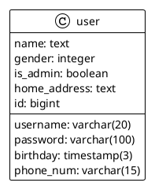

# Backend (Spring Boot + Mybatis)

This practical session requires working with you to implement a user management system with front and back-end
applications. The management system includes the following functions.

- User login
- User registration
- User information viewing

The system architecture is as follows.

- Back-end using Spring Boot + Mybatis + Spring Security to implement the application server
- front-end using Angular + PrimeNG to implement the user interface
- PostgreSQL database and Docker containerization for local startup

## Spring Boot

The back-end architecture consists of the following three layers

- Controller layer, which is used to handle user requests
- Service layer, which is used to handle business logic
- Mapper layer, which is used to handle database operations

### Quick Start

Spring Initializr provides an extensible API to generate JVM-based projects with implementations for several common
concepts:

- Basic language generation for Java, Kotlin and Groovy.
- Build system abstraction with implementations for Apache Maven and Gradle.
- .gitignore support.
- Several hook-points for custom resources generations.

https://docs.spring.io/spring-boot/docs/current/reference/html/index.html
https://start.spring.io/

Dependencies:

- Lombok, Java annotation library which helps to reduce boilerplate code.
- Spring Web WEB, Build web, including RESTful, applications using Spring MVC. Uses Apache Tomcat as the default
  embedded container.
- Spring Security,Highly customizable authentication and access-control framework for Spring applications.
- MyBatis Framework ,Persistence framework with support for custom SQL, stored procedures and advanced mappings. MyBatis
  couples objects with stored procedures or SQL statements using a XML descriptor or annotations.
- Flyway Migration ,Version control for your database so you can migrate from any version (incl. an empty database) to
  the latest version of the schema.
- PostgreSQL Driver ,A JDBC and R2DBC driver that allows Java programs to connect to a PostgreSQL database using
  standard, database independent Java code.

### Gradle

https://docs.gradle.org/current/userguide/userguide.html

Gradle is an open-source build automation tool focused on flexibility and performance. Gradle build scripts are written
using a Groovy or Kotlin DSL. Read about Gradle features to learn what is possible with Gradle.

- Highly customizable — Gradle is modeled in a way that is customizable and extensible in the most fundamental ways.
- Fast — Gradle completes tasks quickly by reusing outputs from previous executions, processing only inputs that
  changed,
  and executing tasks in parallel.
- Powerful — Gradle is the official build tool for Android, and comes with support for many popular languages and
  technologies.

[build.gradle](/backend/build.gradle)

### Controller

Let's start by taking a step back and having a look at the concept of the Front Controller in the typical Spring Model
View Controller architecture.

At a very high level, here are the main responsibilities we're looking at:

- Intercepts incoming requests
- Converts the payload of the request to the internal structure of the data
- Sends the data to Model for further processing
- Gets processed data from the Model and advances that data to the View for rendering

URLs:

- POST: /users, for creating a new user
- GET: /users/{id}, for getting a user by id
- GET: /users/count, for getting the number of users

Useful Annotation in Spring Boot:

- @RestController
- @RequestMapping
- @GetMapping
- @PostMapping
- @PutMapping
- @DeleteMapping
- @RequestBody
- @RequestParam
- @PathVariable

Source Code:

- [UserController](/backend/src/main/java/com/kingland/neusoft/course/controller/UserController.java)

### Service

Service Components are the class file which contains @Service annotation.
These class files are used to write business logic in a different layer, separated from @RestController class file.

Useful Annotation in Spring Boot:

- @Service
- @Autowired

Source Code:

- [UserService](/backend/src/main/java/com/kingland/neusoft/course/service/UserService.java)

## Flywyay

https://flywaydb.org/documentation/

`docker-compose.exe -f C:\Users\gavwu\Development\ksd-neu-training\backend\docker-compose.yml up -d db
`

Flyway is an open-source database migration tool. It strongly favors simplicity and convention over configuration.
It is based around just 7 basic commands: Migrate, Clean, Info, Validate, Undo, Baseline and Repair.

- [V1_0_1__CREATE_COURSE_TABLE](/backend/src/main/resources/db/migration/V1_0_1__CREATE_COURSE_TABLE.sql)

## Mybatis

https://mybatis.org/mybatis-3/index.html

The MyBatis SQL mapper framework makes it easier to use a relational database with object-oriented applications. MyBatis
couples objects with stored procedures or SQL statements using an XML descriptor or annotations. Simplicity is the
biggest advantage of the MyBatis data mapper over object relational mapping tools.

- [CourseApplication](/backend/src/main/java/com/kingland/neusoft/course/CourseApplication.java)

### Datasource Configuration

Application Properties support us to work in different environments. In this chapter, you are going to learn how to
configure and specify the properties to a Spring Boot application.
Spring Boot uses an opinionated algorithm to scan for and configure a DataSource. This allows us to easily get a
fully-configured DataSource implementation by default.

In addition, Spring Boot automatically configures a lightning-fast connection pool, either HikariCP, Apache Tomcat, or
Commons DBCP, in that order, depending on which are on the classpath.

- [application.properties](/backend/src/main/resources/application.properties)

