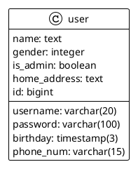

# Backend (Spring Boot + Mybatis + Spring Security)

本次实践课需要和大家一起实现一个具有前后端应用的用户管理系统。该管理系统包括以下功能：

- 用户登录
- 用户注册
- 用户信息查看

该系统架构如下：

- 后端使用Spring Boot + Mybatis + Spring Security实现应用服务器
- 前端使用Angular + PrimeNG实现用户界面
- 数据库使用PostgreSQL,并使用Docker容器化,便于本地启动

## Spring Boot

后端架构包含以下三层

- Controller层，用于处理用户请求
- Service层，用于处理业务逻辑
- Mapper层，用于处理数据库操作

### 快速创建工程

Spring Initializr provides an extensible API to generate JVM-based projects with implementations for several common
concepts:

- Basic language generation for Java, Kotlin and Groovy.
- Build system abstraction with implementations for Apache Maven and Gradle.
- .gitignore support.
- Several hook-points for custom resources generations.

https://start.spring.io/

Dependencies:

- Lombok, Java annotation library which helps to reduce boilerplate code.
- Spring Web WEB, Build web, including RESTful, applications using Spring MVC. Uses Apache Tomcat as the default
  embedded container.
- Spring Security,Highly customizable authentication and access-control framework for Spring applications.
- MyBatis Framework ,Persistence framework with support for custom SQL, stored procedures and advanced mappings. MyBatis
  couples objects with stored procedures or SQL statements using a XML descriptor or annotations.
- Flyway Migration ,Version control for your database so you can migrate from any version (incl. an empty database) to
  the latest version of the schema.
- PostgreSQL Driver ,A JDBC and R2DBC driver that allows Java programs to connect to a PostgreSQL database using
  standard, database independent Java code.

### Controller

Let's start by taking a step back and having a look at the concept of the Front Controller in the typical Spring Model
View Controller architecture.

At a very high level, here are the main responsibilities we're looking at:

- Intercepts incoming requests
- Converts the payload of the request to the internal structure of the data
- Sends the data to Model for further processing
- Gets processed data from the Model and advances that data to the View for rendering

URLs:

- POST: /users, for creating a new user
- GET: /users/{id}, for getting a user by id
- GET: /users/count, for getting the number of users

Useful Annotation in Spring Boot:

- @RestController
- @RequestMapping
- @GetMapping
- @PostMapping
- @PutMapping
- @DeleteMapping
- @RequestBody
- @RequestParam
- @PathVariable

Source Code:

- [UserController](/backend/src/main/java/com/kingland/neusoft/course/controller/UserController.java)

### Service

## Mybatis

### Mapper Interface

### Mapper SQL File

### Datasource Configuration

## Spring Security

### Security Purposes

### Flow of authentication

### Implementation
