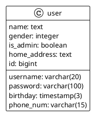

# Backend (Spring Boot + Mybatis + Spring Security)

## Spring Boot

### Controller

### Service

## Mybatis

### Mapper Interface

### Mapper SQL File

### Datasource Configuration

## Spring Security

### Security Purposes

### Flow of authentication

### Implementation
