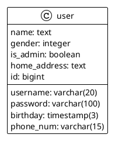

# Backend (Spring Boot + Mybatis + Spring Security)

本次实践课需要和大家一起实现一个简单的用户管理系统。该管理系统包括以下功能：

- 用户登录
- 用户注册
- 用户信息查看

该系统架构如下：

- 后端使用Spring Boot + Mybatis + Spring Security实现应用服务器
- 前端使用Angular + PrimeNG实现用户界面
- 数据库使用PostgreSQL,并使用Docker容器化,便于本地启动

## Spring Boot

### Controller

### Service

## Mybatis

### Mapper Interface

### Mapper SQL File

### Datasource Configuration

## Spring Security

### Security Purposes

### Flow of authentication

### Implementation
