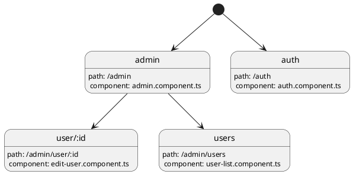

# Angular Application (Angular + PrimeNG)

## Introduction

The UI application also has three layers of the architecture.

- The **Theme System** layer is responsible for the styling of the application.
- The **Component** layer to handle the user behavior and data rendering of application.
- The **Service** layer to handle the business logic of the application.

## PrimeNG

PrimeNG is a set of open source components that are used to build the UI.

https://www.primefaces.org/

## Angular

https://angular.io/

Angular is an application design framework and development platform for creating efficient and sophisticated single-page
apps.

### CLI

https://angular.io/cli

The Angular CLI is a command-line interface tool that you use to initialize, develop, scaffold, and maintain Angular
applications directly from a command shell.

#### add

Adds support for an external library to your project.

#### build

Compiles an Angular app into an output directory named dist/ at the given output path. Must be executed from within a
workspace directory.

#### generate

Generates and/or modifies files based on a schematic.

#### lint

Runs linting tools on Angular app code in a given project folder.

#### new

Create an Angular workspace.

#### run

Runs an Architect target with an optional custom builder configuration defined in your project.

#### serve

Builds and serves your app, rebuilding on file changes.

### Application Router

